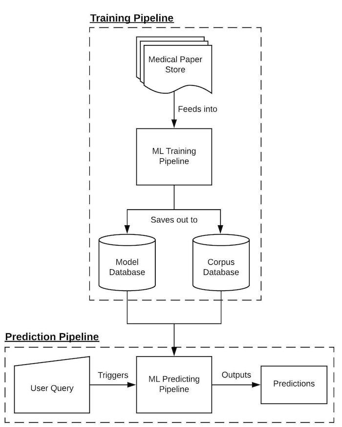

# COVID-19
This is a repositpry that contains my solutions to the tasks presented for the covid-19 Open Dataset challenge. (You can find a description of the challenge here: https://www.kaggle.com/allen-institute-for-ai/CORD-19-research-challenge

# Architectural Design

## High Level Diagram

## ML Training Pipeline Diagrams

## ML Prediction Pipeline Diagram

